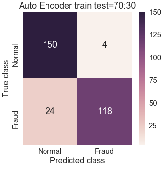
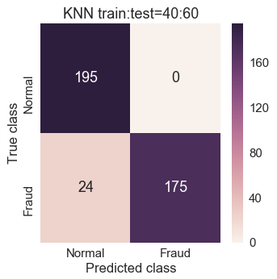
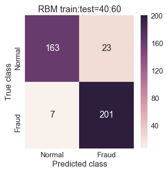
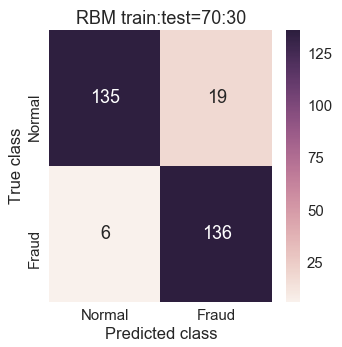

# Credit-Card-Fraud-Detection
Credit card fraudulent has become a threat in modern transaction. Manual regulation process is not sufficient so automatic detection of those fraud transaction is inevitable. This paper discusses credit card fraud detection by machine learning. Data mining has played an powerful role for detect  fraudulent transactions. This modern  world needs the way of detecting online frauds and machine learning is providing the  weapons. We have used supervised as well as unsupervised method for achieving the best result and track credit card fraudulents more effectively.We also deployed several test train split and found that RBM and KNN works better with f1 score .93.

 

